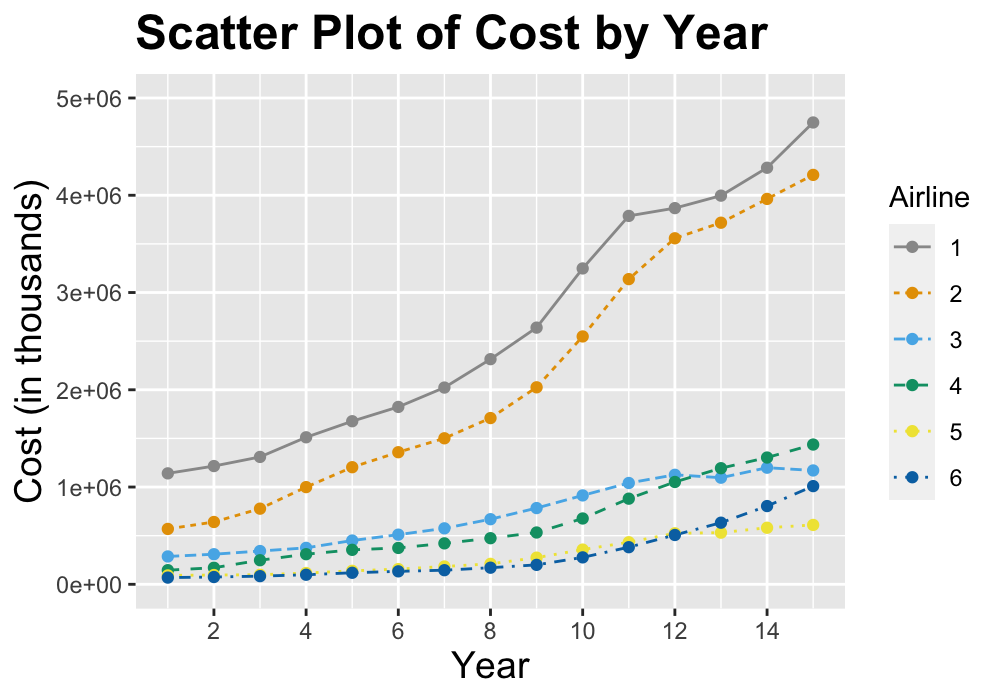

```{r setup, include=FALSE}
knitr::opts_chunk$set(echo = TRUE, cache = FALSE, fig.width = 6, fig.height = 4)
options(width = 55)
library(tidyverse)
```

# Problem 1 - Mammal Sleep

In the `ggplot2` library, there is a tibble called `msleep`. You can load this by loading the `ggplot2` library (type `library(ggplot2)`). From there, you can work with the `msleep` tibble.

### Part a
Below is some code for creating a scatter plot of body weight vs brain weight:
```{r prob1a_point, eval = T, echo = T, fig.width = 6, fig.height = 4}
ggplot(msleep, aes(x = brainwt, y = bodywt)) +
  geom_point()
```

In the code chunk below, modify this code so that it is a line plot instead of a scatter plot.
```{r prob1a_line, eval = T, echo = T}
msleep
ggplot(msleep, aes(x = brainwt, y = bodywt)) +
  geom_line()
```

### Part b
Create a new code chunk below this paragraph and modify the code from part (a) so that both the points and the line are plotted. Change the color of the line and change the color of the points to any color you’d like. Note: you can add on more than one geom function.
```{r prob1b, eval = T, echo = T}
ggplot(msleep, aes(x = brainwt, y = bodywt)) +
  geom_line(col = "blue") +
  geom_point(col = 'darkblue')
```

### Part c
Clearly, it is difficult to see all the points on the plot since many are bunched together. We can alleviate this by plotting the on the log (base 10) scale. Using [tidyverse]{.underline} functions, define a new data frame (call it `msleep2`) with two new variables: one that is the log of `brainwt` and one that is the log of `bodywt`. You can just use the `log10()` function to actually take the log of those variables. Then insert a code chuck below that produces a scatter plot with the log of body weight on the y-axis and the log of brain weight on the x-axis. Be sure the x and y axis labels to indicate that the variables are logged.
```{r prob1c, eval = T, echo = T}
msleep2 <- msleep |>
  mutate(logbrain = log(brainwt), logbody = log(bodywt))

ggplot(msleep2, aes(x = logbrain, y = logbody)) +
  geom_point() +
  labs(x = expression(paste(Log[10], "(Brain Weight)")), 
       y = expression(paste(Log[10], "(Body Weight)")))
```

### Part d
An alternative way to plot these data on the log scale is to plot the untransformed variables on the x and y axes and then adding on the functions `scale_y_log10()` and `scale_x_log10()` to your plot. Go ahead and do this in a code chunk below. Note that these functions will adjust the scale on the axes so that they correspond to the original variable scales, not the logged variable scales. Very nice!
```{r prob1d, eval = T, echo = T}
ggplot(msleep, aes(x = brainwt, y = bodywt)) +
  geom_point() +
  scale_x_log10() +
  scale_y_log10()
```

#### Part e
Below is some code to produce a bar plot of the `vore` variable, which tells us whether the animal is a carnivore, omnivore or herbivore:
```{r prob1e_1, eval = T, echo = T}
ggplot(msleep, aes(x = vore)) +
  geom_bar()
```

However, this bar plot is quite boring looking. In a code chunk below, make a bar plot of the `conservation` variable and make it more colorful. Feel free to spice up the bar plot for the `vore` variable above as well.
```{r prob1e_2, eval = T, echo = T}
ggplot(msleep, aes(x = conservation)) +
  geom_bar(color = "black", fill = "lightblue")
```

### Part f
The following code will create a histogram for the `awake` variable, which tells us how long the animal stays awake per day (in hours):
```{r prob1f_1}
ggplot(msleep, aes(x = awake)) +
  geom_histogram(color = "black", fill = "orange", bins = 10)
```

First, modify that code in the above code chunk so we can easily see each bar in the histogram. Use colors of your choice. Then, in a code chunk below, create a box plot instead of a histogram for the `awake` variable. Make the box plot look better with the color and fill options.
```{r prob1f_2}
ggplot(msleep, aes(y = awake)) +
  geom_boxplot(col = "black", fill = "lightblue")
```

### Part g
The following code will create box plots of the sleep_time variable split by conservation with the labels changed:
```{r prob1g_1}
ggplot(msleep, aes(x = conservation, y = sleep_total, 
                   fill = conservation)) +
  geom_boxplot() + 
  labs(x = "Conservation Status", 
       y = "Total Sleep Time ", 
       fill = "Conservation ")
```

In a new code chunk, create box plots of `sleep_rem` split by the `vore` variable. Change the labels to be appropriate. Also, explain what the fill option does here. How does this differ from putting the fill option in the `geom_boxplot()` function?
```{r prob1g_2}
ggplot(msleep, aes(x = vore, y = sleep_rem, fill = vore)) +
  geom_boxplot() +
  labs(x = "Vore", y = "Total Rem Sleep Time", fill = "Vore")
```


### Part h
The following code will give density plots of the logged brain weight in the `msleep2` data frame you created in part (c) split by conservation. If you called your variable something different than `logbrain` in part (c), you will have to adjust that here. This code also adjusts the labels, adds a title, and changes the font size. Note: I put `eval = F` in the **R** code chunk option because I did not create an `msleep2` tibble, so this would not run.
```{r prob1h_1, echo = T, eval = F}
ggplot(msleep2, aes(x = logbrain, fill = conservation)) +
  geom_density(alpha = 0.5) + 
  labs(x = "Log(Brain Weight)", y = "Density", 
       title = "Density Plots of Log(Brain Weight)") +
  theme(axis.title = element_text(size = 14))
```

Adjust this code to make density plots for `logbody` (that you also created in part (c)) split by `vore`. Adjust the `labs()` options to make them appropriate for this situation. Also, change the size of the axis labels to be 16 and make the title bold font.
```{r prob1h_2}
ggplot(msleep2, aes(x = logbody, fill = vore)) +
  geom_density(alpha = 0.5) + 
  labs(x = "Log(Body Weight)", y = "Density") +
  ggtitle("Density Plots of Log(Body Weight)") +
  theme(axis.title = element_text(size = 16),
        plot.title = element_text(size = 16, face = "bold"))
```


# Problem 2 - College Distance

In the Data folder that is in the Workshops directory on the GitHub page [found here](https://github.com/wevanjohnson/2024_05_RRDS_R_Workshop) is the data set `CollegeDistance.csv` that was collected in the 1980s on high school students. This data set contains the following variables:

* **gender**: factor indicating gender. 
* **ethnicity**: factor indicating ethnicity (African-American, Hispanic or other). 
* **score**: base year composite test score. These are achievement tests given to high school seniors in the sample. 
* **fcollege**: factor. Is the father a college graduate? 
* **mcollege**: factor. Is the mother a college graduate? 
* **home**: factor. Does the family own their home? 
* **urban**: factor. Is the school in an urban area? 
* **unemp**: county unemployment rate in 1980. 
* **wage**: state hourly wage in manufacturing in 1980. 
* **distance**: distance from 4-year college (in 10 miles). 
* **tuition**: average state 4-year college tuition (in 1000 USD). 
* **education**: number of years of education. 
* **income**: factor. Is the family income above USD 25,000 per year?
* **region**: factor indicating region (West or other).

For each part, insert an **R** code chunk that does what is asked. 

### Part a
Read this data set into **R**. Use the tidyverse function `read_csv()` to read it in as a tibble rather than a data frame.
```{r prob2a}
college <- read_csv(paste0("~/My Drive/Red Rock Data Science Conference",
                           "/2024/2024_05_RRDS_R_Workshop/",
                           "Friday_Workshops/Data/CollegeDistance.csv"))
```

### Part b
Create a bar plot of the `gender` variable. Give it a title and change the y axis label to “Frequency”. Feel free to make the bars look nicer as well! 
```{r prob2b}
ggplot(college, aes(x = gender)) +
  geom_bar(col = "black", fill = "lightblue") +
  labs(x = "Gender", y = "Frequency", title = "Barplot of Gender")
```

### Part c
Although pie charts are inferior to bar charts in virtually every way, use this website, <https://r-graph-gallery.com/piechart-ggplot2.html>, to look up how to make a pie chart in `ggplot2` and make one for the `ethnicity` variable. Some tidyverse functions like `group_by()`, and `summarize()` will be useful here. This is a bit more challenging, so feel free to come back to this one later. 
```{r prob2c}
college |> 
  group_by(ethnicity) |>
  summarize(value = n()) |>
  ggplot(aes(x = "", y = value, fill = ethnicity)) +
  geom_bar(stat = "identity", width = 1) +
  coord_polar("y", start = 0) +
  theme_void() +
  labs(fill = "Ethnicity") +
  scale_fill_discrete(labels = c("African American", "Hispanic", "Other"))
```

### Part d
Make a stacked bar chart for ethnicity split by income (one bar for each income) so that each bar has a height of 1. Adjust the labels so that they are "African American", "Hispanic", and "Other". You can do this with the `labels` option in the `scale_fill_manual()` function. Then change the colors to be colorblind-friendly. One palette that is good for this is the following:
```{r cbPalette, echo = T, eval = T}
cbPalette <- c("#999999", "#E69F00", "#56B4E9", "#009E73", 
               "#F0E442", "#0072B2", "#D55E00", "#CC79A7")
```

That palette above is good for up to 8 categories. You can use those colors by putting `values = cbPalette` in the `scale_fill_manual()` function.
```{r prob2d}
ggplot(college, aes(x = income, fill = ethnicity)) +
  geom_bar(position = "fill") +
  labs(x = "Income", y = "Frequency", fill = "Ethnicity") + 
  ggtitle("Barplot of Ethnicity by Income") +
  scale_fill_manual(labels = c("African American", "Hispanic", "Other"),
                    values = cbPalette)
```

### Part e 
Another way to easily change the palette is with the `scale_fill_brewer()` function. There are built-in palettes available. You can also change the fill legend labels with the `labels` option in this function. At this website: <https://r-graph-gallery.com/38-rcolorbrewers-palettes.html>, you can see the available palettes. Replace the `scale_fill_manual()` function from the previous part of this problem with the `scale_fill_brewer()` and use a palette that looks good to you. 
```{r prob2e}
ggplot(college, aes(x = income, fill = ethnicity)) +
  geom_bar(position = "fill") +
  labs(x = "Income", y = "Frequency", fill = "Ethnicity") + 
  ggtitle("Barplot of Ethnicity by Income") +
  scale_fill_brewer(labels = c("African American", "Hispanic", "Other"),
                    palette = "Set1")
```

### Part f
Create a scatter plot with `tuition` on the y-axis and `unemp` on the x-axis. Change the x and y labels to be "Unemployment Rate" and "Average 4-Year College Tuition (in thousands)". Change the plot so that the color of the points are based on the region. Then change the size of the labels to be 14 (the default size is 11) and put a title that is size 14 and bold. Finally, look up how to adjust where the tick marks and grid lines are on the y-axis and put space them every 0.25 thousand.
```{r prob2f}
ggplot(college, aes(x = unemp, y = tuition)) +
  geom_point(aes(color = region)) +
  labs(x = "Unemployment Rate",
       y = "Average 4-Year College Tuition (in thousands)",
       title = "Plot of Tuition vs Unemployment",
       color = "Region") +
  scale_color_discrete(labels = c("Other", "West")) +
  scale_y_continuous(breaks = seq(0.25, 1.5, by = 0.25)) +
  theme(axis.title = element_text(size=14),
        plot.title = element_text(size=14, face = "bold"))
```

### Part g
Create a histogram of the distance variable. Change the x-axis label so the units of distance are shown and add a title. Also, change the color from gray to one of your choice and put borders around the histogram bars. Finally, change the background theme to be anything but gray.
```{r prob2g}
ggplot(college, aes(x = distance)) +
  geom_histogram(col = "black", fill = "lightblue", bins = 20) +
  labs(x = "Distance from College (in 10 miles)", y = "Frequency") + 
  ggtitle("Histogram of Distance") +
  theme_dark()
```

### Part h
Create side-by-side box plots for the score variable split by income. Change the x-axis and y-axis labels and give the plot a title. Change the color of the box plots to one of your choice.
```{r prob2h}
ggplot(college, aes(x = income, y = score)) + 
  geom_boxplot(fill = "darkgreen") +
  labs(x = "Income Level", y = "Composite Test Score") +
  ggtitle("Histogram of Score by Income Level")
```

### Part i
Create a bar plot of gender with bars split by ethnicity. Use `position = "dodge"` to get ggplot to put the bars side by side. 
```{r prob2i}
ggplot(college, aes(x = gender, fill = ethnicity)) +
  geom_bar(col = "black", position = "dodge") +
  labs(x = "Gender", y = "Frequency",
       title = "Barplot of Gender Split by Ethnicity") + 
  scale_fill_discrete(labels = c("African\nAmerican", "Hispanic", "Other"))
```


# Problem 3 - Airlines
The file `airlines.csv` can also be found on the GitHub page. This data set contains information about 6 airlines from 6 years between 1970 to 1984. This includes the airline, the year, the cost (in $1,000), the output index number (in revenue passenger miles), the fuel price, and the average load factor of the fleet. 

### Part a
Read the data file into **R** using a tidyverse function. Change the airline variable from numeric to a factor using a pipe and the `mutate()` function. 
```{r prob3a}
air <- read_csv(paste0("~/My Drive/Red Rock Data Science Conference",
                           "/2024/2024_05_RRDS_R_Workshop/",
                           "Friday_Workshops/Data/airlines.csv")) |>
  mutate(airline = as.factor(airline))
```

### Part b
Create a plot that looks as similar as possible to the one in the image below. Note, the range on the y-axis is from 0 to 5,000,000 and the color palette is that `cbPalette` we used earlier. The line type can be changed by putting `geom_line(aes(linetype = airline))`. The font size of the axis labels is 14 and the sizer of the title is 18.

{width=80%}
```{r airlines1, eval = T}
ggplot(air, aes(x = year, y = cost, color = airline)) +
  geom_line(aes(linetype = airline)) +
  lims(y = c(0, 5000000)) + 
  geom_point() +
  labs(x = "Year", y = "Cost (in thousands)", 
       color = "Airline", linetype = "Airline",
       title = "Scatter Plot of Cost by Year") +
  scale_color_manual(values = cbPalette) +
  scale_x_continuous(breaks = seq(0, 16, by = 2)) +
  theme(axis.title = element_text(size = 14),
        plot.title = element_text(size = 18, face = "bold"))
```

### Part c
Now, instead of plotting all six airlines on the same plot, use `facet_grid()` to graph six plots (one for each airline) side-by-side. Type `?facet_grid()` to learn a bit more about this function. The Internet is full of examples as well. Be sure to put `labeller = label_both` in the `facet_grid()` function so it is more readable. 
```{r airlines2, eval = T, fig.width = 12, fig.height = 6}
ggplot(air, aes(x = year, y = cost, color = airline)) +
  geom_line(aes(linetype = airline)) +
  lims(y = c(0, 5000000)) + 
  geom_point() +
  labs(x = "Year", y = "Cost (in thousands)", 
       color = "Airline", linetype = "Airline",
       title = "Scatter Plot of Cost by Year") +
  scale_color_manual(values = cbPalette) +
  scale_x_continuous(breaks = seq(0, 16, by = 2)) +
  theme(axis.title = element_text(size = 14),
        plot.title = element_text(size = 18, face = "bold")) +
  facet_grid(cols = vars(airline), labeller = label_both)
```
