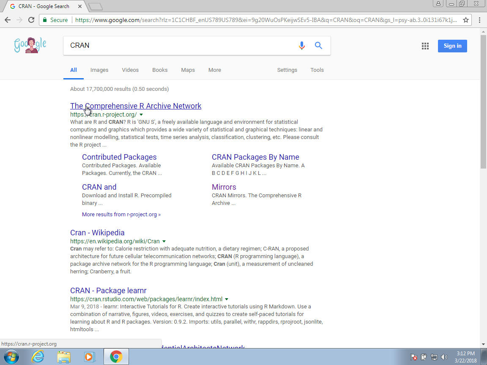
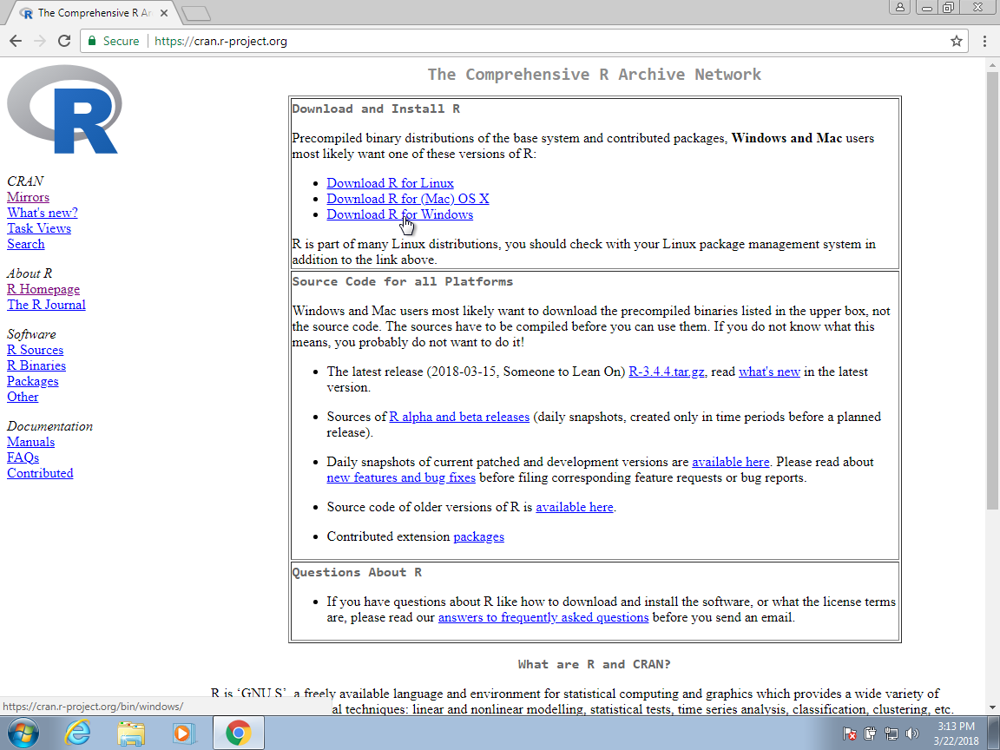
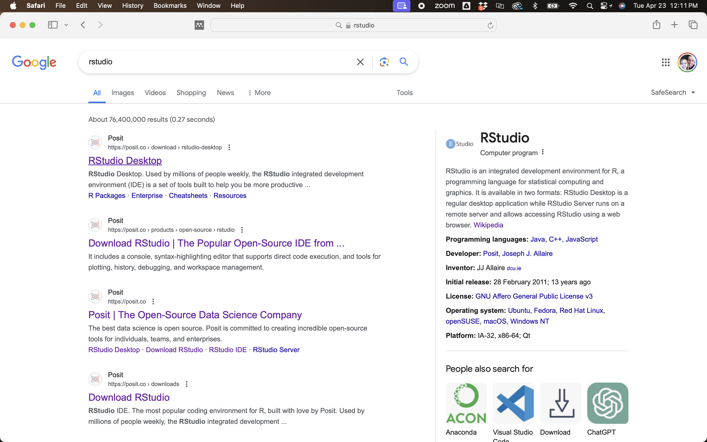

```{r setup, include=FALSE}
knitr::opts_chunk$set(echo = TRUE, fig.align="center")
img_path <- "figs/"
```

## R Tutorials (GitHub and YouTube)
Dr. Johnson will provide an online R tutorial on GitHub: [https://github.com/wevanjohnson/2024_04_R_tutorial](https://github.com/wevanjohnson/2024_04_R_tutorial)

## R Tutorials (GitHub and YouTube)

\scriptsize
| Lecture     | Topics                                |
| :-----------| :------------------------------------ |
| Lecture 1   | Installing R, RStudio, and R packages |
| Lecture 2   | Introduction to R/RStudio             |
| Lecture 3   | R basics, Part 1                      |
| Lecture 4   | R basics, Part 2                      |
| Lecture 5   | R basics, Part 3                      |
| Lecture 6   | Programming Basics                    |
| Lecture 7   | R Markdown                            |
| Lecture 8   | Input/output data, Data structures    |
| Lecture 9   | The tidyverse                         |
| Lecture 10  | Visualization with ggplot2, Part 1    |
| Lecture 11  | Visualization with ggplot2, Part 2    |
| Lecture 12  | Visualization with ggplot2, Part 3    |
| Lecture 13  | Creating R Packages                   |
| Lecture 14  | Shiny Programming, Part 1              |
| Lecture 15  | Shiny Programming, Part 2              |


# Installation Details

## Important installations
You will need to install the following: \vskip .1in

**Mac Users**

* R and R Studio
* Know how to access a terminal (Rstudio or Terminal)
* git (type `git --version` in the terminal)

\vskip .1in
	
**Windows Users:**

* R and R Studio
* A terminal app (Git Bash, MobaXterm, Putty)
* Git for Windows

## R and Rstudio

**R** is a language for statistical computing and graphics. **RStudio** is an interactive desktop environment (IDE), but it is not R, nor does it include R when you download and install it. Therefore, to use RStudio, we first need to install R.

\center
{height=50%}


## Installing R (Windows and Mac)

You can download R from the Comprehensive R Archive Network (CRAN)^[https://cran.r-project.org/]. Search for CRAN on your browser:



## Installing R (Windows and Mac) 

Once on the CRAN page, select the version for your operating system: Linux, Mac OS X, or Windows. Here we show screenshots for Windows, but the process is similar for the other platforms. When they differ, we will also show screenshots for Mac OS X.



## Installing RStudio (Windows and Mac)

To install RStudio, start by searching for "RStudio" on your browser:



## Installing RStudio (Mac)
You should find the Posit/RStudio website as shown above. Once there, click on "Download RStudio Desktop for Mac OS 12+" below the _2: Install RStudio_ header. 
\center
{ width=85% }

## More on R and Rstudio

See more detailed instructions at in Lecture 1 at: [https://github.com/wevanjohnson/2024_04_R_tutorial](https://github.com/wevanjohnson/2024_04_R_tutorial)

## Accessing the terminal and installing Git

For Wednesday (4/24), you will also need to install a terminal and install Git (and get a GitHub account). 

Detailed instructions: https://rafalab.github.io/dsbook/accessing-the-terminal-and-installing-git.html

## Why R?

R is not a programming language for software development like C or Java. It was created by statisticians as an environment for data analysis. A history of R is summarized here: [A Brief History of S](http://lcolladotor.github.io/courses/Courses/R/resources/history_of_S.pdf). 

{height=40%}

The __interactivity__ of R (more later), is an indispensable feature in data science because, as you will learn, the ability to quickly explore data is a necessity for success in this field. 

## RStudio

One of the great advantages of R over point-and-click analysis software is that you can save your work as scripts. You can edit and save these scripts using a text editor. We will use the interactive _Integrated Development Environment_ (IDE) [RStudio](https://www.rstudio.com/). 


## Objects
Suppose we are asked to solve the quadratic equation $x^2 + x -1 = 0$, we can define:

```{r}
a <- 1
b <- 1
c <- -1
```

which stores the values for later use. We use `<-` to assign values to the variables. We can also assign values using `=` instead of `<-`, but we recommend against using `=` to avoid confusion.

## Objects
To see the value stored in a variable, we simply ask R to evaluate `a` and it shows the stored value:

```{r}
a
```

A more explicit way to ask R to show us the value stored in `a` is using `print` like this:

```{r}
print(a)
```

## The Workspace
Now since these values are saved in variables, to obtain a solution to our equation, we use the quadratic formula:  

```{r}
(-b + sqrt(b^2 - 4*a*c) ) / ( 2*a )
(-b - sqrt(b^2 - 4*a*c) ) / ( 2*a )
```


## Scripts
To solve another equation such as $3x^2 + 2x -1$, we can copy and paste the code above and then redefine the variables and recompute the solution:

```{r, eval=FALSE}
a <- 3
b <- 2
c <- -5
(-b + sqrt(b^2 - 4*a*c)) / (2*a)
(-b - sqrt(b^2 - 4*a*c)) / (2*a)
```
By creating and saving a script with the code above, we would not need to retype everything each time and, instead, simply change the variable names. Try writing the script above into an editor and notice how easy it is to change the variables and receive an answer.

## Functions 

Once you define variables, the data analysis process can usually be described as a series of __functions__ applied to the data. R includes several predefined functions and most of the analysis pipelines we construct make extensive use of these. 

## Functions 
Most functions require one or more __arguments__. Below is an example of how we assign an object to the argument of the function `log`. Remember that we earlier defined `a` to be 1:

```{r}
log(8)
log(a) 
```

## Functions 
You can change the default values by simply assigning another object:

```{r}
log(8, base = 2)
```

Note that we have not been specifying the argument `x` as such:
```{r}
log(x = 8, base = 2)
```

## Installing R packages

The functionality provided by a fresh install of R is only a small fraction of what is possible. In fact, we refer to what you get after your first install as __base R__. The extra functionality comes from add-ons available from developers. 

There are currently hundreds of these available from CRAN and many others shared via other repositories such as GitHub. However, because not everybody needs all available functionality, R instead makes different components available via __packages__. 

## Installing R packages
R makes it very easy to install packages from within R. For example, to install the __dslabs__ package, which we use to share datasets and code related to this book, you would type:

```{r,eval=FALSE}
install.packages("dslabs")
```

We can install more than one package at once by feeding a character vector to this function:

```{r, eval=FALSE, echo=TRUE}
install.packages(c("tidyverse", "dslabs"))
```


##  Vectors 

In R, the most basic objects available to store data are __vectors__. As we have seen, complex datasets can usually be broken down into components that are vectors. For example, in a data frame, each column is a vector. Here we learn more about this important class.

## Creating Vectors

We can create vectors using the function `c`, which stands for __concatenate__. We use `c` to concatenate entries in the following way:

```{r}
codes <- c(380, 124, 818)
codes
```

## Creating Vectors
We can also create character vectors. We use the quotes to denote that the entries are characters rather than variable names.

```{r}
country <- c("italy", "canada", "egypt")
```


## Names

Sometimes it is useful to name the entries of a vector. For example, when defining a vector of country codes, we can use the names to connect the two:

```{r}
codes <- c("italy" = 380, "canada" = 124, "egypt" = 818)
codes
```


## Subsetting elements

The elements of vectors can be obtained using the following:

```{r}
codes[1]
codes["italy"]
codes[2:3]
```


## Data Frames 

The most common way of storing a dataset in R is in a __data frame__, which is a combination of several (columns of) vectors. 

Data frames are particularly useful for datasets because we can combine different data types into one object. 

## Data Frames 
A large proportion of data analysis challenges start with data stored in a data frame. For example, we stored the data for our motivating example in a data frame. You can access this dataset by loading the __dslabs__ library and loading the `murders` dataset using the `data` function:

```{r}
library(dslabs)
data(murders)
```

## Data Frames 
We can show the first six lines using the function `head`:

```{r}
head(murders)
```

## The Accessor: `$`

For our analysis, we will need to access the different variables represented by columns included in this data frame. To do this, we use the accessor operator `$` in the following way:
\footnotesize
```{r}
murders$population
```

## Subsetting Columns and Rows
In addtion the columns and rows of a data frame can be subsetted using the following syntax:

\footnotesize
```{r}
murders[1,1]
murders[1,]
murders[,4]
```

## Programming Basics

By coding in R, we can efficiently perform exploratory data analysis, build data analysis pipelines, and prepare data visualization to communicate results. However, R is not just a data analysis environment but a programming language. 

You should also understdn the following three key programming concepts: __conditional expressions__, __for-loops__, and __functions__. These are not just key building blocks for advanced programming, but are sometimes useful during data analysis. 


## R markdown

R markdown is a format for **literate programming** documents. Literate programming weaves instructions, documentation, equations, and detailed comments among executable code.

It is based on __markdown__, a markup language that is widely used to generate html pages. You can learn more about markdown with the following tutorial: [**click here**](https://www.markdowntutorial.com/)

## R markdown

You can start an R markdown document in RStudio by clicking on __File__, __New File__, then __R markdown__. You will then be asked for a title and author. 

Once you gain experience with R markdown, you will be able to do this without the template and can simply start from a blank template.

As a convention, we use the `.Rmd` suffix for R markdown files 

## Compiling the document using `knitR`

With R markdown, you need to __compile__ the document into the final report. We use the `knitR` package to to do this. The specific function used to compile is the `knit` function, which takes a filename as input. 

RStudio provides a `Knit` button that makes it easy and convenient to compile the document.

## The Header

At the top of the document is the R markdown header:
```{r eval=F}
---
title: "Nanostring Analysis"
author: "Evan Johnson"
date: "12/5/2019"
output: html_document:
---
```

R markdown reports can be to be in HTML, PDF, Microsoft Word, or presentation formats. By changing the `output` to, for example `pdf_document` or `word_document`, we can control the type of output that is produced.  

## The Header
Other output options include code folding, themes, etc.:
```{r eval=F}
---
title: "Nanostring Analysis"
author: "Evan Johnson"
date: "12/5/2019"
output:
  html_document:
    code_folding: hide
    toc: true
    toc_float: true
    theme: "flatly"
editor_options: 
  chunk_output_type: console
---
```

## R Code Chunks

In various places in the document, we see something like this:
````{verbatim}
```{r}
summary(pressure)
```
````

These are the **code chunks**. When you compile the document, the R code inside the chunk, in this case `summary(pressure)`, will be evaluated and the result included in that position in the final document. 

## R Code Chunks

Its a good habit to adding a label to the R code chunks. This will be very useful when debugging, among other situations. You do this by adding a descriptive word like this:

````{verbatim}
```{r pressure-summary}
summary(pressure)
```
````

## R Code Chunks

We can also add plots to our report:
````{verbatim}
```{r, out.width = '60%', fig.align = 'center'}
plot(pressure)
```
````

```{r, echo=F, out.width = '60%', fig.align = 'center'}
plot(pressure)
```

The options `out.width` and `fig.align` adjust the figrue size and loction. 


## R Code Chunks

By default, the code will show up as well. To avoid having the code show up, you can use an argument. To avoid this, you can use the argument `echo=FALSE`. For example:

````{verbatim}
```{r, echo=FALSE}
summary(pressure)
```
````

If you want to include the code in the document, but not run the code and/or include results, you can use the argument `eval=FALSE`:

````{verbatim}
```{r, eval=FALSE}
# You can install the tidyverse using:
install.packages(tidyverse)
```
````

## R Code Chunks (global `knitr` options)
One of the R chunks may contain a complex looking call:

````{verbatim}
```{r setup, include=FALSE}
knitr::opts_chunk$set(echo = TRUE)
```
````

The `include=FALSE` option in the chunk call will tell the system to run the R code, but not include it in the html/pdf/word report. 

The R code in the chunk sets the `knitr` default to `echo=TRUE` in the call for any R chunks following this one.  

## Other Code Chunks

`knitr` can execute code in many languages besides R:

````{verbatim}
```{python}
x = [2, 1, 3]
print(x[0],"Hello Python!")
```
````

```{python, echo=F}
x = [2, 1, 3]
print(x[0],"Hello Python!")
```

Some of the available language engines include: Python, SQL, Bash, Rcpp, Stan, JavaScript, and CSS. These will also have echo=F, so they are not evaluated.


## \LaTeX\ Equations
One exciting feature about R markdown is that it allows you to include \LaTeX\ equations to be rendered in html, pdf, or Word. 

For example, to show the probability under the normal curve in the interval $(a,b)$, you can use the \LaTeX\ code:
\footnotesize
```{verbatim}
\mbox{Pr}(a < x < b) = 
  \int_a^b \frac{1}{\sqrt{2\pi}\sigma} 
  e^{-\frac{1}{2}\left( \frac{x-\mu}{\sigma} \right)^2} \, dx
```

\normalsize 
This will be rendered by `knitr` as:

$$\mbox{Pr}(a < x < b) = \int_a^b \frac{1}{\sqrt{2\pi}\sigma} e^{-\frac{1}{2}\left( \frac{x-\mu}{\sigma} \right)^2} \, dx$$


## Other Options (tabsets)
One very useful tool in Markdown is to add tabs to the html document: 

````{verbatim}
## This is a header {.tabset}
### This is Tab 1
### This is Tab 2
## This is a new header (not in the tabs)
````

The `{.tabset}` option will make all lower level subheadings tabs in the html. The next same or higher level header will break out of the tabset.  

## Other Options (tabsets)
__Pro tip:__ tabs can be generated dynamically:
````{verbatim}
## My Header {.tabset}
```{r, results = 'asis'}
n <- 10
for (i in 1:n){
  cat("###" , "Tab", i, "\n")
    print(i)
  cat("\n\n")
}
```
````


## Other Options
We will explore other R markdown options:  headers, tabsets, and \LaTeX\ equations in class and in your Exercises. 
\vskip .2 in
\underline{Note:} From now on, all R-based Exercises should preferably be done using an R markdown document. Your document should include headers, descriptive text, equations, R code, and  plots/figures! 

 
## More on R markdown

There is a lot more you can do with R markdown. We highly recommend you continue learning as you gain more experience writing reports in R. There are many free resources on the internet including:

1. RStudio's tutorial: https://rmarkdown.rstudio.com
2. The cheat sheet: https://www.rstudio.com/wp-content/uploads/2015/02/rmarkdown-cheatsheet.pdf
3. The knitR book: https://yihui.name/knitr/

## Exercises
R markdown is a powerful tool for literate prgramming. To gain more practice, recreate the .Rmd file for
the example file: "Rmarkdown_example.html."

## Session info
\tiny
```{r session info}
sessionInfo()
```

