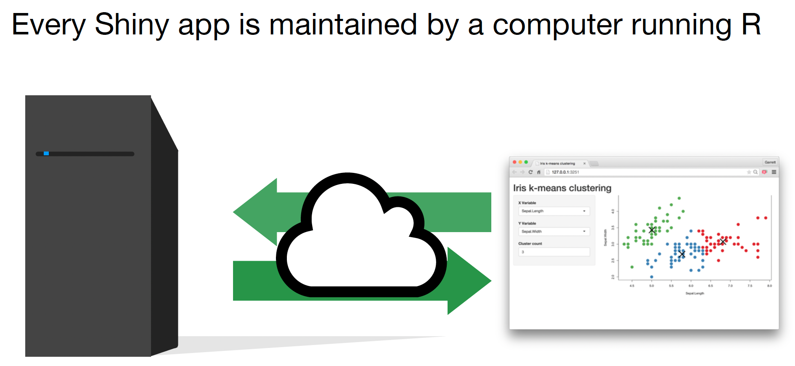
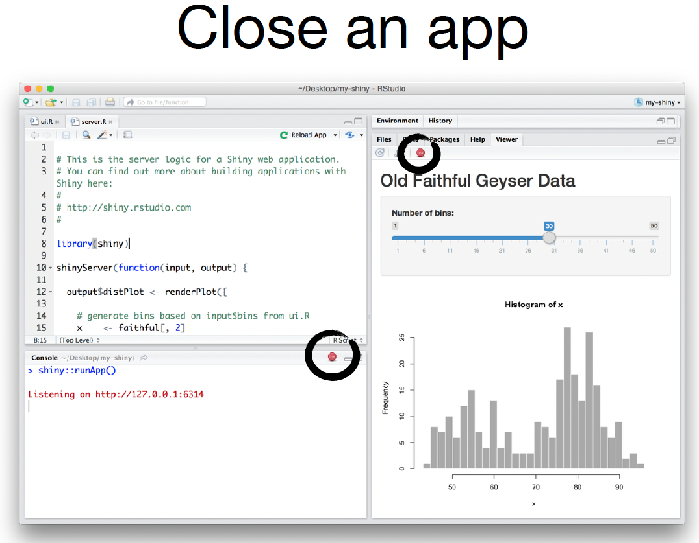
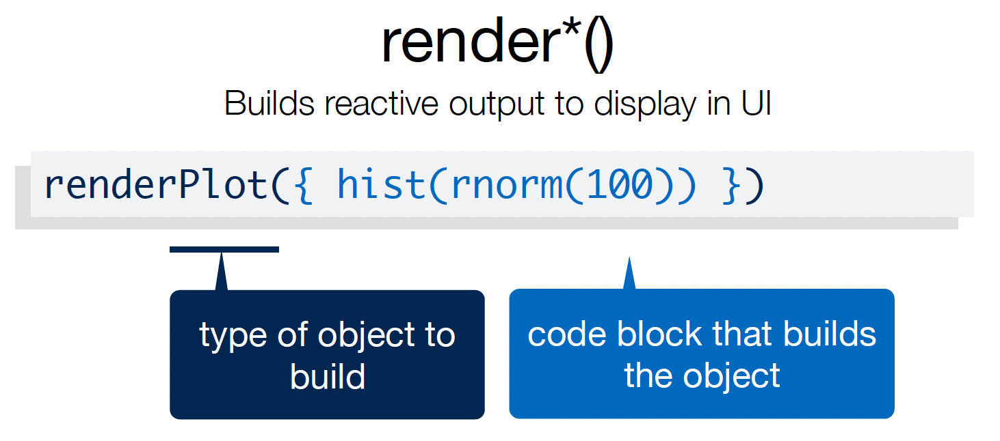

```{r setup, include=FALSE}
knitr::opts_chunk$set(echo = FALSE)
```

## What is Shiny?

`Shiny` is an R package that allows you to easily create rich, interactive web apps around your R functions and packages. `Shiny` allows you to take your work in R and disseminate it via a web browser so that anyone can use it. `Shiny` makes you look awesome by making it easy to produce polished web apps with a minimum amount of pain.

(Credit: Some of the images and slide text were taken and adapted from [https://mastering-shiny.org](https://mastering-shiny.org) and RStudio's `Shiny` tutorials)

## What is Shiny?

`Shiny` is designed primarily with data scientists in mind, and to that end, you can create pretty complicated `Shiny` apps with no knowledge of HTML, CSS, or JavaScript. On the other hand, `Shiny` doesn’t limit you to creating trivial or prefabricated apps: its user interface components can be easily customized or extended, and its server uses reactive programming to let you create any type of back end logic you want. 

## What is Shiny?
Some of the things people use `Shiny` for are:

* Create dashboards
* Replace hundreds of pages of PDFs with interactive apps
* Communicate complex models informative visualizations 
* Provide self-service data analysis for common workflows
* Create interactive demos for teaching statistics and data science

In short, `Shiny` gives you the ability to pass on some of your `R` superpowers to anyone who can use the web.

## Getting Started
To create your first `Shiny` App you wil need:

* Install R: Come on now!!
* Install RStudio (strongly recommended): [https://www.rstudio.com/products/rstudio/download](https://www.rstudio.com/products/rstudio/download)
* The R `Shiny` package: `install.packages("shiny")`
* Knowledge and experience in developing R packages (recommended)
* Git and GitHub (recommended): to share your Apps


## Getting Started

If you haven’t already installed `Shiny`, install it now with:
```{r shiny_install, eval=F, echo=T}
install.packages("shiny")
```

If you’ve already installed `Shiny`, use the following to check that you have version 1.5.0 or greater:
```{r shiny_install2, echo=T}
packageVersion("shiny") 
```


## Shiny Introduction
RStudio's [Shiny Showcase](www.rstudio.com/products/shiny/shiny-user-showcase/) is an exciting assembly of exciting apps!

Or we can start with a very simple example
```{r intro, eval=F, echo=T}
library(shiny)
runExample("01_hello")
```

## Shiny Introduction
Or an example from Dr. Johnson's research:
```{r intro2, eval=F, echo=T}
devtools::install_github("compbiomed/animalcules")
library(animalcules)
run_animalcules()
```
(Warning: this might take a while to load package dependencies!)

## Shiny Architecture


## Shiny Architecture



## Shiny Architecture


## Introduction to shiny development

Here we’ll create a simple `Shiny` app, staring with  the minimum boilerplate, followed by the two key components of every `Shiny` app: the UI (short for user interface) which defines how your app looks, and the server function which defines how your app works. `Shiny` uses **reactive** programming to automatically update outputs when inputs change. 


## Template: shortest viable app

The simplest way to start an app is to create a new directory, and add a single file called app.R, with the following code:

```{r first app,eval=F,echo=T}
library(shiny)

ui <- fluidPage()

server <- function(input, output) {}

shinyApp(ui = ui, server = server)
```

## Close your app
\center


## Inputs and outputs
\center


## Inputs and outputs
\center


## Adding elements to the UI
Add elements to your app as arguments to fluidPage()
```{r shiny ui 1,eval=F,echo=T}
library(shiny)

ui <- fluidPage(
    # Input() functions,
    # Output() functions
    )

server <- function(input, output) {}

shinyApp(ui = ui, server = server)
```

## Adding elements to the UI
Add elements to your app as arguments to `fluidPage()`

```{r first app UI,eval=F,echo=T}
library(shiny)

ui <- fluidPage(
  "Hello World!"
  )

server <- function(input, output) {}

shinyApp(ui = ui, server = server)
```


## Input functions
Create an input with an **Input()** function.
```{r inputs,eval=F,echo=T}
sliderInput(inputId = "num", 
            label = "Choose a number", 
            value = 25, min = 1, max = 100)
```

Here is the actual HTML code for this slider:
\footnotesize
```{html inputsHTML,eval=F,echo=T}
<div class="form-group shiny-input-container">
  <label class="control-label" for="num">Choose a number</label>
  <input class="js-range-slider" id="num" data-min="1" data-max="100"
  data-from="25" data-step="1" data-grid="true" data-grid-num="9.9"
  data-grid-snap="false" data-prettify-separator="," data-keyboard="true"
  data-keyboard-step="1.01010101010101"/>
</div>
```

## Shiny buttons
\center


## Input functions in an app
Create an input with an **Input()** function.
```{r input2,eval=F,echo=T} 
library(shiny)

ui <- fluidPage(
  sliderInput(inputId = "num",
    label = "Choose a number",
    value = 25, min = 1, max = 100)
  )

server <- function(input, output) {}

shinyApp(server = server, ui = ui)
```

## Shiny buttons
\center


## Shiny outputs
\center

## Shiny outputs
\center


## Shiny outputs
\center


## Adding outputs
Create an output with an **Output()** function.
```{r input3,eval=F,echo=T} 
library(shiny)

ui <- fluidPage(
  sliderInput(inputId = "num",
    label = "Choose a number",
    value = 25, min = 1, max = 100), ## Note the comma!
  plotOutput("hist")
  )

server <- function(input, output) {}

shinyApp(server = server, ui = ui)
```

Note that you must build the output in the server first!

## Shiny outputs
\center


## Building the server
There are 3 basic rules for your **server** function:

1. Access input values with __input$__
2. Save objects to display as __output$__
3. Build objects to display with __render()__

## Server inputs
You can access inputs from the UI using __input$__
\center


## 
\center

## Server outputs
You can save your outputs to return to the UI using __output$__
\center


## Server outputs
You can save your outputs to return to the UI using __output$__
\center


## Rendering server outputs
Build objects to display with __render()__
\center


## Rendering server outputs
\center



## Rendering server outputs
\center


## Reactivity 101
The term **reactivity** refers to the idea that the inputs and outputs are connected to each other: when you change and input, you change all outputs that require the input.

Reactivity is an exciting charateristic, but can also get you in trouble!

## Server recap


## Complete Shiny app
Now putting everything together:
\footnotesize
```{r final,eval=F,echo=T} 
library(shiny)

ui <- fluidPage(
  sliderInput(inputId = "num",
    label = "Choose a number",
    value = 25, min = 0, max = 100), 
  plotOutput("hist")
  )

server <- function(input, output){
  output$hist <- renderPlot({
    hist(rnorm(input$num))
    })
  }

shinyApp(server = server, ui = ui)
```

## Multi-file apps: 
Now lets get more organized, create a **ui.R** file
\footnotesize
```{r final multifile,eval=F,echo=T} 
#ui.R
library(shiny)
ui <- fluidPage(
  sliderInput(inputId = "num",
    label = "Choose a number",
    value = 25, min = 1, max = 100), 
  plotOutput("hist")
  )
```
\normalsize
And a **server.R** file: 
\footnotesize
```{r final multifile3, eval=F, echo=T} 
#server.R
library(shiny)
server <- function(input, output){
  output$hist <- renderPlot({
    hist(rnorm(input$num))
    })
  }
```

## Multi-file apps: 
And then finally the program file, **app.R**: 
```{r final multifile2, eval=F, echo=T} 
#app.R
library(shiny)

source("ui.R")
source("server.R")

shinyApp(server = server, ui = ui)
```

## Building apps in R packages: 
In an R package, create an `inst/shiny` directory and place the `Shiny` code there. Also:

* Write the package functions first!
* This includes all analytics AND plotting functions
* `Shiny` app should call functions, provide inputs, display results
* Operate on high-quality R data objects!

Also, see examples from Dr. Johnson's research, e.g.: [https://github.com/compbiomed/animalcules](https://github.com/compbiomed/animalcules)

## Session Info
\tiny
```{r pressure}
sessionInfo()
```

